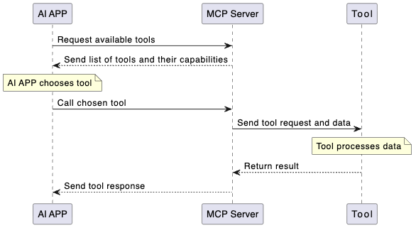
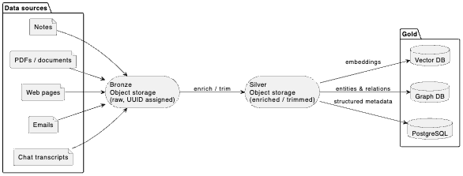

# Ai Second Brain

This procts is a small personal project on about how to create a second brain for you AI. 

## Scope: 
1. There will be no user authentication or user scoped retrieval. (NO MCP Gateway)
2. Everything will be stored in a single database (Postgress) and will be accessible to all users.
3. Everything is run locally.
4. Time to build is around 8 hours. 
5. MCP sessions is stateless so far

## Types of AI brains: 
There are 3 architecture choices, ranking in complexity and capabilities.
1. **Markdown Brain**: This is the simplest brain, it will store all the information in a markdown format. It will be able to retrieve information based on keywords, tags and relations.
2. **Vector Brain**: This brain will store all the information in a vector format, allowing for more complex retrieval based on semantic similarity. It will be able to retrieve information based on keywords, tags, relations, and semantic similarity. 
3. **Graph Brain**: This brain will store all the information in a graph format, allowing for even more complex retrieval based on relationships between entities. It will be able to retrieve information based on keywords, tags, relations, semantic similarity, and graph traversal.

All three brains can be combined in a hybrid approach. Litterature says that the markdown brain is efficient and good for small or personal knowledge bases, but its outpreformed once documents is 
over 100.  

## Flow in information:
The architecture of the Ai Second Brain will be based on a modular design, allowing for easy integration of different components. The main components will include:

1. **Data Ingestion**: This component will be responsible for ingesting data from various sources, such as text files, PDFs, and web pages. It will also be responsible for extracting relevant information from the ingested data and storing it in the appropriate format (markdown, vector, or graph).

2. **Data Storage**: This component will be responsible for storing the ingested data in the appropriate format (markdown, vector, or graph) in a Postgres database. It will also be responsible for managing the database schema and ensuring data integrity.

3. **Data Retrieval**: This component will be responsible for retrieving data from the database based on user queries. It will support various retrieval methods, including keyword search, tag-based search, relation-based search, semantic similarity search, and graph traversal search.

4. **User Interface**: This component will provide a user-friendly interface for interacting with the Ai Second Brain. It will allow users to input queries, view retrieved information, and manage the stored data. The interface will be designed to be intuitive and easy to use, with support

## Architecture:

### Service

AI APP -> MCP Server -(Send list of tools and their capabilities)-> AI APP --> (AI APP choose tool) --> MCP Server -(Send tool request and data)-> Tool --> (Tool process data) --> MCP Server -(Send tool response)-> AI APP 

### Data
 

## Notes
These architecture choices are not in depth and more meant to give a overview of how the project would work. 
